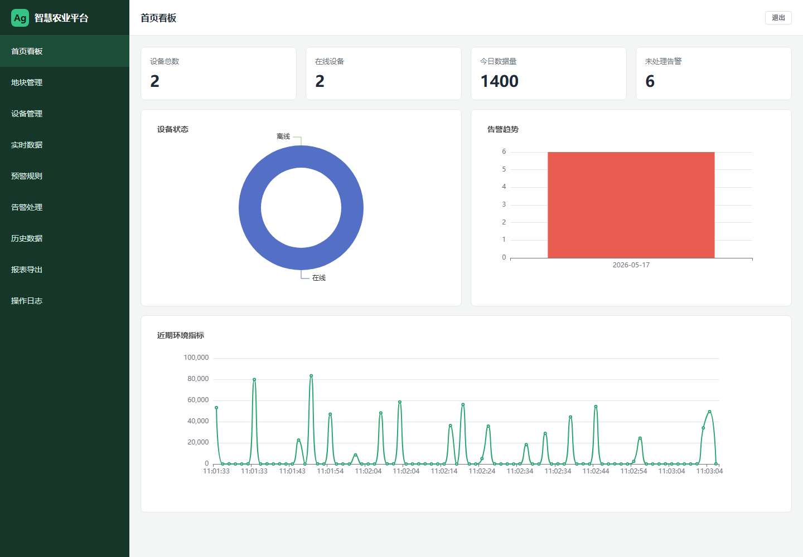
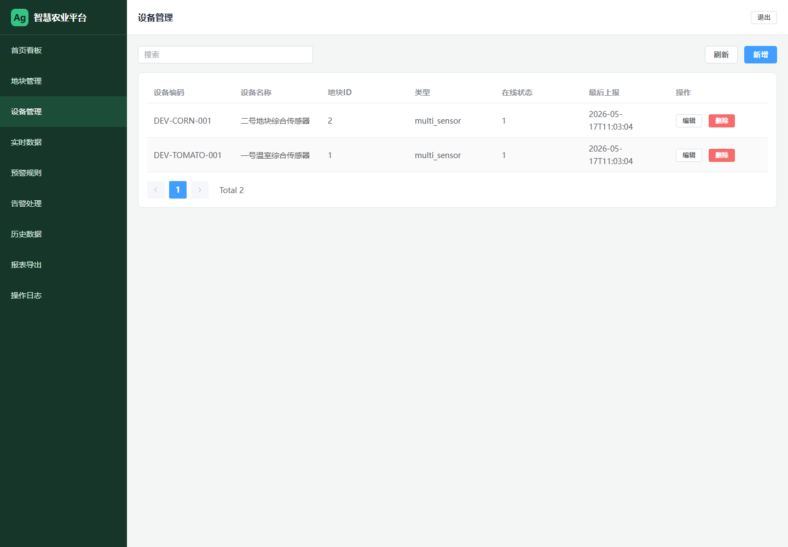
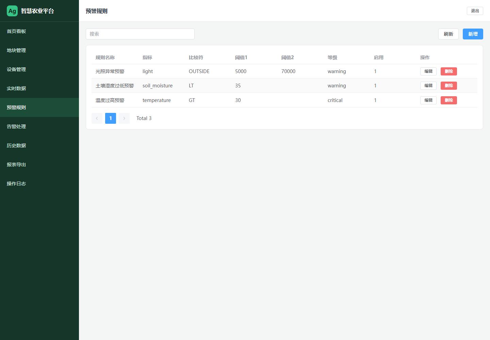
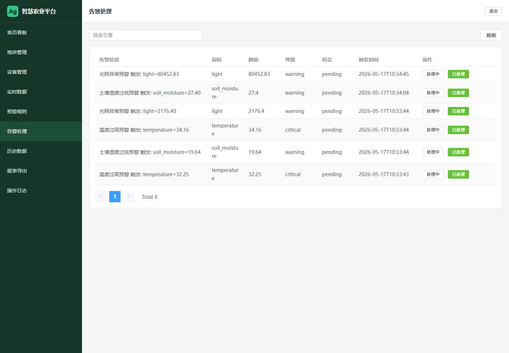
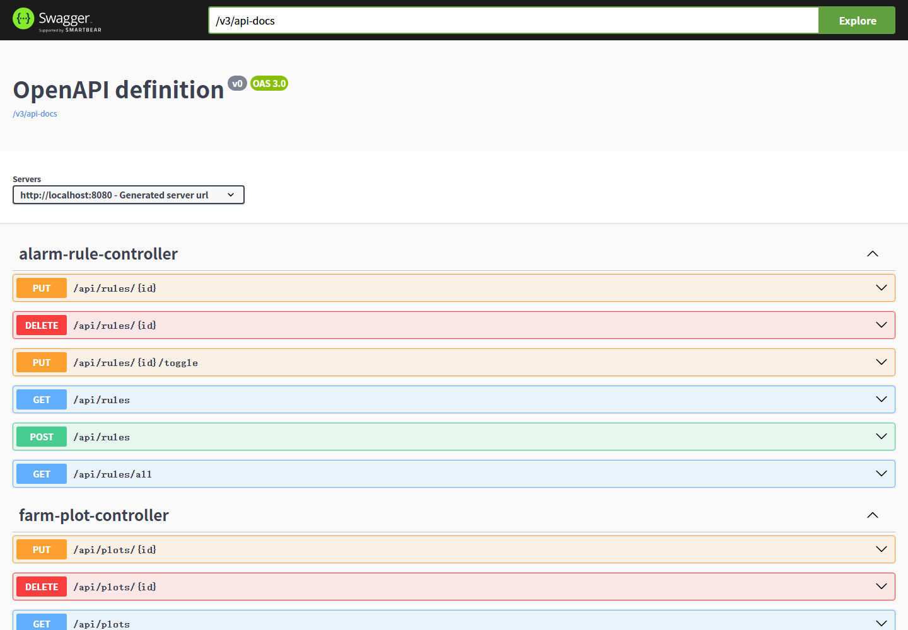

# 智慧农业设备监测与预警平台

面向 Java 后端岗面试的中等 MVP：农田地块接入模拟传感器，系统展示实时环境数据，按规则触发告警，并支持告警处理、历史查询、统计看板和 Excel 导出。

## 技术栈

- 后端：Spring Boot 3、MyBatis-Plus、MySQL 8、Redis、JWT、EasyExcel、Springdoc OpenAPI
- 前端：Vue 3、Vite、Element Plus、ECharts
- 部署：Docker Compose

## 5 分钟启动

```powershell
cd C:\Users\yyds\GitHub\ai-works\smart-agri-monitor
docker compose up --build
```

访问地址：

- 前端：http://localhost:8088
- 后端健康检查：http://localhost:8080/api/health
- Swagger：http://localhost:8080/swagger-ui.html

默认账号：

- 用户名：`admin`
- 密码：`admin123`

## 一分钟项目亮点

- 后端链路完整：登录鉴权、主数据 CRUD、模拟采集、规则预警、告警处理、历史查询、报表导出。
- 工程能力明确：MyBatis-Plus 数据访问、Redis 缓存、JWT 鉴权、定时任务、统一响应、Docker Compose 部署。
- 面试可讲性强：能围绕表设计、告警去重、缓存策略、中文乱码排查、容器化部署展开。

## 演示流程

1. 登录后台，进入首页看板，展示设备数量、今日数据量、未处理告警和图表。
2. 打开地块管理，说明系统按农田地块组织设备。
3. 打开设备管理，展示模拟设备编码、所属地块、在线状态。
4. 打开预警规则，说明温度、土壤湿度、光照阈值规则。
5. 打开实时数据，等待定时任务生成传感器数据。
6. 打开告警处理，展示规则命中后的告警记录，并把告警改为处理中或已处理。
7. 打开历史数据，按指标查看曲线。
8. 打开报表导出，下载传感器数据或告警记录 Excel。
9. 打开 Swagger，展示后端接口文档和 REST API 设计。

## 运行截图

### 首页看板



### 设备管理



### 预警规则



### 告警处理



### Swagger 接口文档



## 项目结构

```text
smart-agri-monitor
├─ backend               Spring Boot 后端
├─ frontend              Vue 3 管理后台
├─ deploy/mysql/init.sql 数据库表结构和种子数据
├─ docs/architecture.md  架构图和面试讲解点
└─ docker-compose.yml    一键部署 MySQL、Redis、后端、前端
```

## 重点接口

- `POST /api/auth/login` 登录
- `GET /api/dashboard/stats` 看板统计
- `GET /api/plots` 地块分页
- `GET /api/devices` 设备分页
- `GET /api/rules` 预警规则分页
- `POST /api/sensor-data` 设备数据上报
- `GET /api/sensor-data/latest` 最新数据
- `GET /api/sensor-data/history` 历史数据
- `PUT /api/alarms/{id}/handle` 告警处理
- `GET /api/reports/sensor-data` 传感器数据导出
- `GET /api/reports/alarms` 告警记录导出

## 常见问题

### Docker 后端构建慢

后端 Dockerfile 已使用 Maven 批处理构建，并通过 `backend/settings.xml` 配置 Maven Central 镜像。首次构建需要下载依赖，后续会复用 Docker 缓存。

```powershell
docker compose build backend --progress=plain
```

### MySQL 中文乱码

`docker-compose.yml` 已强制 MySQL 使用 `utf8mb4`，`init.sql` 也显式设置 `SET NAMES utf8mb4`。如果旧容器里已经导入过乱码数据，可执行：

```powershell
docker cp .\deploy\mysql\fix-seed-data.sql smart-agri-mysql:/tmp/fix-seed-data.sql
docker exec -i smart-agri-mysql mysql -uroot -proot123456 --default-character-set=utf8mb4 smart_agri -e "source /tmp/fix-seed-data.sql"
```

### 默认账号无法登录

初始化用户为 `admin / admin123`。数据库中保存的是启动时生成的 BCrypt 密文；如果清空了 MySQL volume，重新 `docker compose up --build` 会自动初始化。

## 最小验收清单

- `http://localhost:8080/api/health` 返回 `UP`
- `http://localhost:8080/swagger-ui.html` 能打开
- `http://localhost:8088` 能登录
- 实时数据页能看到模拟传感器数据
- 告警处理页能看到规则触发的告警
- 报表导出页能下载 Excel

## 简历描述

基于 Spring Boot + MyBatis-Plus + MySQL + Redis + Vue 3 设计并实现智慧农业设备监测与预警平台。项目包含 JWT 登录鉴权、地块与设备管理、模拟传感器数据采集、规则阈值预警、告警去重与处理、ECharts 看板、历史查询和 EasyExcel 报表导出，并使用 Docker Compose 完成一键部署。
