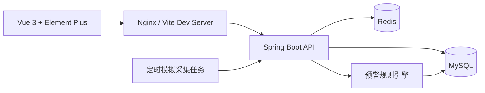

# 智慧农业设备监测与预警平台架构说明

## 架构

## 面试讲解点

- 模块化单体：按认证、地块、设备、传感器数据、规则、告警、看板、报表拆分。
- 规则引擎：数据入库后同步匹配启用规则，支持大于、小于、区间外。
- 告警去重：同设备同规则存在未处理或处理中告警时，不重复生成。
- Redis 使用：token 缓存、设备最新数据、看板短缓存。
- 部署：Docker Compose 管理 MySQL、Redis、后端、前端，适合演示和简历项目。
