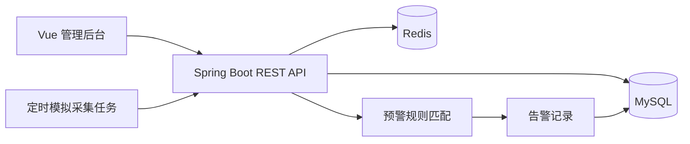

# 智慧农业设备监测与预警平台面试讲解稿

## 3-5 分钟项目介绍

这个项目是一个面向农业场景的设备监测与预警平台，主要用来展示 Java 后端常见工程能力。系统中有地块、设备、传感器数据、预警规则和告警记录几个核心对象。后端通过定时任务模拟设备上报温度、空气湿度、土壤湿度和光照数据，数据入库后会匹配启用中的预警规则，超过阈值就生成告警。前端提供管理后台，可以完成登录、设备管理、规则配置、实时数据查看、告警处理、历史曲线和 Excel 导出。

技术栈上，后端使用 Spring Boot 3 + MyBatis-Plus，数据库是 MySQL，热点数据和 token 使用 Redis，接口鉴权用 JWT，接口文档用 Springdoc OpenAPI，报表导出用 EasyExcel。前端使用 Vue 3 + Element Plus + ECharts。部署上用 Docker Compose 一次性启动 MySQL、Redis、后端和前端，便于面试演示。

项目重点不是堆功能，而是把一个后端项目从数据建模、接口设计、规则判断、缓存使用、定时任务、报表导出到容器化部署完整跑通。面试时我会重点讲三块：第一是表结构和业务边界，第二是预警规则匹配与告警去重，第三是 Redis 和 Docker 在项目里的实际作用。

## 架构讲解

- 前端只负责展示、表单和图表，所有业务判断放在后端。
- MySQL 保存用户、地块、设备、传感器数据、规则、告警和操作日志。
- Redis 保存登录 token、设备最新数据和看板短缓存。
- 定时任务模拟真实设备上报，避免依赖硬件。
- 规则引擎在数据入库后同步执行，保证告警能及时生成。

## 核心表设计

- `user`、`role`：登录和角色基础表，第一版只做管理员角色。
- `farm_plot`：地块信息，包括位置、面积、作物类型、负责人。
- `device`：设备信息，包括设备编码、所属地块、在线状态、最后上报时间。
- `sensor_data`：传感器数据明细，按设备、指标、采集时间建立查询索引。
- `alarm_rule`：预警规则，支持指标、比较符、阈值、启停状态。
- `alarm_record`：告警记录，保存触发值、等级、处理状态和处理说明。
- `operation_log`：记录关键增删改和告警处理动作。

## 预警规则怎么做

规则包含指标类型、比较符和阈值。当前支持：

- `GT`：大于阈值触发
- `GTE`：大于等于阈值触发
- `LT`：小于阈值触发
- `LTE`：小于等于阈值触发
- `OUTSIDE`：低于下限或高于上限触发

每次传感器数据入库后，系统查询启用中的规则，只匹配相同指标、同设备或同地块范围的规则。命中后先查是否已经存在同设备、同规则、状态为 `pending` 或 `processing` 的告警；如果存在就不重复生成，避免告警刷屏。

## Redis 怎么用

- 登录 token：JWT 生成后写入 Redis，接口鉴权时既校验签名，也校验 Redis 中是否存在 token。
- 设备最新数据：每次设备上报后，把最新指标写入 Redis，实时数据页优先读缓存。
- 看板统计：设备数量、未处理告警、趋势数据做短时间缓存，降低重复统计查询压力。

## Docker 部署怎么讲

项目用 Docker Compose 管理四个服务：MySQL、Redis、后端和前端。MySQL 容器首次启动时执行 `deploy/mysql/init.sql` 初始化表结构和种子数据。后端镜像用 Maven 构建 Spring Boot jar，前端镜像用 Node 构建静态资源，再由 Nginx 提供访问和 API 反向代理。

## 面试追问与回答

### 1. 为什么第一版用单体架构，不用微服务？

这个项目是面试级 MVP，业务边界不复杂，单体更容易保证开发效率、部署简单和链路完整。后续如果设备规模、规则计算和数据分析压力变大，可以把数据采集、规则计算、报表导出拆成独立服务。

### 2. 传感器数据量变大后怎么优化？

先按设备、指标、采集时间建立联合索引；历史查询必须带时间范围。数据量继续变大后，可以按月份分表，或者把明细数据归档到时序数据库，MySQL 保留近期热数据和业务主数据。

### 3. 告警为什么要去重？

传感器会持续上报，如果温度持续超阈值，每次上报都生成告警会刷屏。用“同设备 + 同规则 + 未处理状态”做去重，可以保留问题存在的事实，同时避免重复干扰处理人员。

### 4. JWT 为什么还要放 Redis？

纯 JWT 一旦签发，在过期前不好主动失效。放 Redis 后可以实现退出登录、服务端主动踢下线、token 统一过期管理。

### 5. 看板统计为什么要缓存？

看板通常会被频繁刷新，统计查询可能涉及多张表和时间范围。短缓存能降低数据库压力，同时 5-10 秒的数据延迟对监控看板是可以接受的。

### 6. 定时任务模拟设备有什么意义？

它让项目不依赖真实硬件，也能完整展示数据上报、规则匹配、告警生成和看板刷新链路。面试时可以说明真实环境会替换成 MQTT、HTTP 网关或消息队列接入。

### 7. 为什么导出用 EasyExcel？

EasyExcel 对大数据量导出更友好，内存占用比传统 POI 直接操作更低。这个项目第一版数据量不大，但使用 EasyExcel 更贴近生产实践。

### 8. 如何保证接口安全？

接口统一走 JWT 拦截器，除登录和健康检查外都要求 token。密码不明文保存，默认账号启动时写入 BCrypt 密文。生产环境还应补充 HTTPS、限流、权限粒度控制和审计。

### 9. MySQL 中文乱码怎么排查？

从三层排查：SQL 文件编码、客户端连接字符集、MySQL 表字符集。本项目在 `init.sql` 中显式 `SET NAMES utf8mb4`，表也指定 `utf8mb4`，Compose 中也设置 MySQL 默认字符集。

### 10. Docker 构建慢怎么处理？

首次 Maven 下载依赖慢是正常现象。项目使用 `settings.xml` 配置 Maven Central 镜像，并保留 Docker 分层缓存。构建失败时用 `docker compose build backend --progress=plain` 查看完整日志。

### 11. 如果规则很多，匹配会不会慢？

当前规则量很小，同步匹配足够。规则量变大后，可以按指标类型、设备、地块预加载规则到缓存；也可以把规则匹配放到消息队列消费者中异步处理。

### 12. 项目还有哪些可以继续优化？

可以补菜单级权限、设备离线判断、规则表达式引擎、数据分表、MQTT 接入、消息队列削峰、WebSocket 推送和 CI/CD。但第一版优先保证核心链路完整可演示。

## 简历写法

基于 Spring Boot 3 + MyBatis-Plus + MySQL + Redis + Vue 3 实现智慧农业设备监测与预警平台，支持 JWT 鉴权、地块与设备管理、模拟传感器采集、阈值规则预警、告警去重处理、ECharts 看板、历史查询和 EasyExcel 报表导出，并使用 Docker Compose 完成 MySQL、Redis、后端和前端的一键部署。
